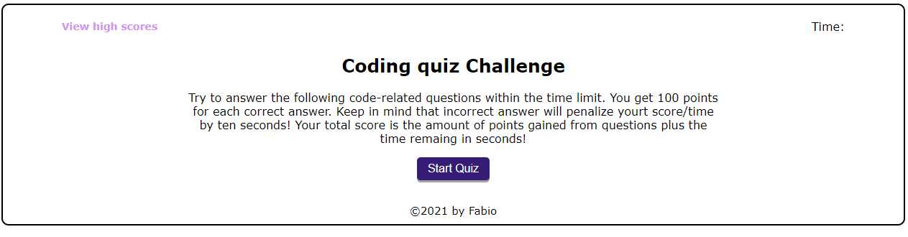
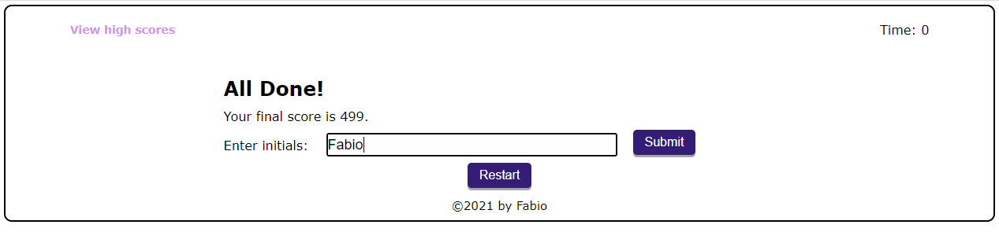

# Web-API-Quiz

## Website

[Take a coding quiz challenge and get a highscore!] (https://fchoi1.github.io/Web-API-Quiz/)

## Technologies

Made using HTML, CSS, Javascript, with focus on DOM, API and element manipulate with Javascript

## Screenshots

## How it works

1. Press the start button to start quiz

2. A 100 second timer begins to count down as questions pop up.

    * You GAIN 100 points for every correct answer
    * You LOSE 10 seconds for every wrong answer

3. Finish answer all the questions until time runs out

4. Enter your initials and save your score:

    

5. Restart the quiz or view the highscores

    

    
